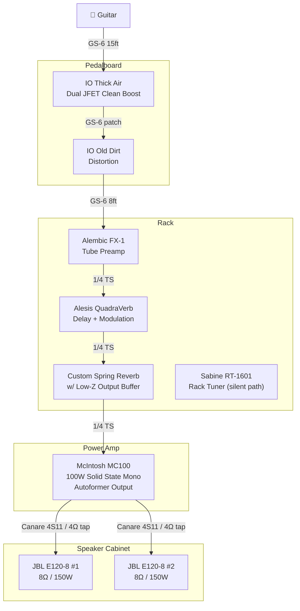
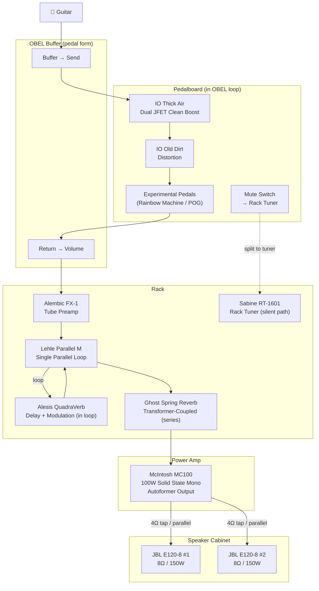

# Signal Chain

## Current State

## Aspirational / Future State

## Signal Flow Philosophy

1. **Buffer immediately.** Place a high-quality buffer (Thick Air stage 1, or dedicated OBEL buffer) as close to the guitar as possible to combat cable capacitance and preserve high-end.
2. **Gain stages before preamp.** Thick Air → Old Dirt provide clean boost and dirt that hit the Alembic's tube front-end. The Alembic is run clean — edge of breakup at most.
3. **Time effects after preamp.** QuadraVerb runs in a parallel loop via the **Lehle Parallel M** — dry signal never touches A/D conversion. Ghost Spring stays in series after the Lehle (fully analog, Mix pot handles blend). QuadraVerb handles delay and modulation only — reverb programs retired.
4. **Reverb last before power amp.** The spring tank with low-impedance buffer is the final device before the MC100, just like Jerry's Fender Reverb Unit placement between F-2B and MC2300.
5. **Clean power, always.** The MC100 should never clip. All tone and dynamics come from preceding gain stages.
