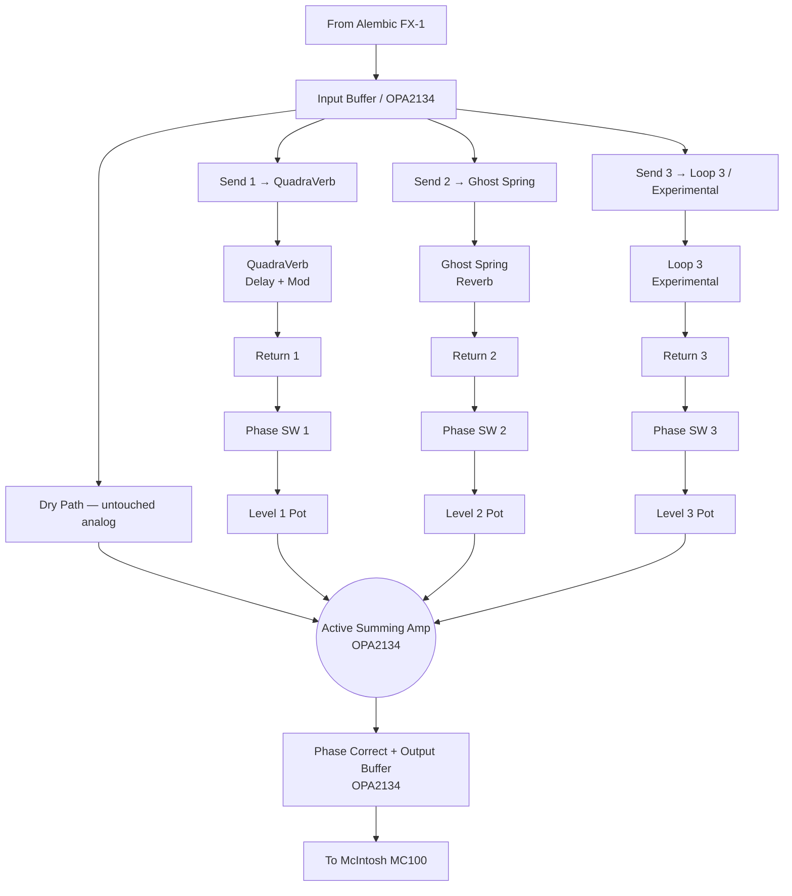

# Rack Parallel Mixer — Design Document

## 1. Concept & Vision
A 3-channel active parallel line mixer that sits post-preamp in the rack. The Alembic FX-1 output feeds the mixer input. The dry signal passes through completely untouched — analog, no conversion, no coloration — while up to three effects units run in parallel loops. Their wet signals are blended back in at the return stage and summed with the dry before going to the MC100.

This is the fix for the single remaining weakness in the current series chain: the QuadraVerb's 16-bit A/D converters sitting in the main signal path.

---

## 2. Pedal Routing Philosophy

The rig has two distinct signal zones, and effects belong in one or the other — not both:

### Pre-Preamp (Pedalboard / OBEL Loop)
**What goes here:** Drive, gain, and tone-shaping that needs to interact with the Alembic's tube input stage.
- IO Thick Air — JFET clean boost
- IO Old Dirt — distortion
- Wah, envelope filter (future) — reactive effects that depend on guitar impedance

### Post-Preamp (Parallel Mixer Loops)
**What goes here:** Time and space effects that process the full preamp output. These should never color the dry signal.

| Loop | Assigned Unit | Type |
|---|---|---|
| Loop 1 | Alesis QuadraVerb | Delay + Modulation |
| Loop 2 | Ghost Spring Reverb | Analog Spring Reverb |
| Loop 3 | Experimental (open) | Any: Rainbow Machine, POG, MOTOR, future rack unit |

**Loop 3 note:** Accepts rack gear or a pedalboard-format pedal powered inside the rack. The Rainbow Machine and POG are better here (post-preamp pitch shifting is cleaner and more stable) than in the pedalboard loop. The OBEL loop is for reactive, impedance-sensitive effects only.

---

## 3. Architecture



---

## 4. Circuit Design

### Input Buffer (U1 — OPA2134, unity gain)
- R_in: 100kΩ (input impedance — no loading on Alembic FX-1 output)
- Unity-gain voltage follower
- 4 outputs (dry + 3 sends), each isolated by 1kΩ series resistor

### Active Splitter
- U1 output drives 4 branches simultaneously
- Each branch: 1kΩ series isolation resistor prevents cross-talk between loads
- Send trims: 10kΩ cermet trimmer (internal, rear-accessible) per loop — sets the level going to each effect unit. Lets you calibrate for units with different input sensitivities.

### Effects Loops (× 3)
- Send: ¼" TS jack. Signal comes from U1 via send trim. Set effects unit to 100% wet / kill dry.
- Return: ¼" TS jack. Returned signal goes through phase switch, then level pot, then summing amp.
- **Phase switch (DPDT toggle per loop):** Swaps the signal polarity. Critical — many effects units (including the QuadraVerb) invert phase. Flip this if the effect sounds thin or hollow when blended in.

### Active Summing Amplifier (U2 — OPA2134, inverting)
Sums dry path + 3 loop returns into a single output. Inverting topology is standard for summing — the phase correct stage compensates.

- R_dry: 22kΩ (dry path input resistor — always connected, no level pot on dry)
- R_L1, R_L2, R_L3: 22kΩ each (loop return input resistors)
- R_f: 22kΩ (feedback resistor — unity gain per channel)
- Result: each channel contributes unity gain to the sum. With dry only → unity output. With dry + one effect at 50% level → 1.5× (slight headroom margin, stays clean on ±15V rails).

### Phase Correct + Output Buffer (U3a/b — OPA2134)
- **U3a:** Inverting unity-gain amp (R_in = R_f = 10kΩ) — corrects summing amp's phase inversion. Also functions as the output drive stage.
- **R_out:** 100Ω series on output — isolates from cable capacitance, prevents oscillation.
- Output: ¼" TS to McIntosh MC100 RCA input (via TS-to-RCA adapter)

### Power Supply
Same ±15V linear topology as the Ghost Spring reverb tank. Toroidal transformer (15VA), bridge rectifier, LM7815/LM7915 regulators. See `docs/reverb-tank/design.md §7` for identical supply design.

---

## 5. Front Panel Layout (1U)

Left to right:
```
[INPUT] [S1] [R1] [LEVEL1] [ϕ1] [S2] [R2] [LEVEL2] [ϕ2] [S3] [R3] [LEVEL3] [ϕ3] [OUTPUT]
```

| Control | Type | Function |
|---|---|---|
| INPUT | Switchcraft ¼" TS | From Alembic FX-1 |
| SEND 1–3 | Switchcraft ¼" TS × 3 | To effects units |
| RETURN 1–3 | Switchcraft ¼" TS × 3 | From effects units |
| LEVEL 1–3 | 100kΩ audio pot × 3 | Wet signal blend per loop |
| PHASE 1–3 | DPDT toggle × 3 | Phase invert per loop return |
| OUTPUT | Switchcraft ¼" TS | To McIntosh MC100 |

---

## 6. Key Operating Rules

1. **Kill dry on every effects unit.** Set QuadraVerb, Ghost Spring, and any Loop 3 unit to 100% wet. If a unit outputs dry signal, it will phase-combine with the mixer's own dry path and cause comb filtering — a hollow, scooped sound.
2. **Use phase switches before blending.** When first connecting an effect, blend it in slowly with the Level pot. If the sound gets thin or the low end disappears, flip the Phase switch for that loop.
3. **Send trim calibration (one-time setup).** Set each unit's input level using the internal send trimmers so the effect's input meter peaks around −6dBFS. This prevents digital clipping in the QuadraVerb and overdriving the Ghost Spring's driver transformer.

---

## 7. Mechanical
- **Chassis:** 1U aluminum rackmount (Hammond or equivalent)
- **Front panel:** Custom aluminum via Front Panel Express — 8 jacks, 3 pots, 3 switches
- **PCB:** FR4 perfboard (Vector T44 or equivalent)
- **Power supply:** Internal ±15V linear — identical to Ghost Spring
- **Estimated BOM:** ~$240–280
