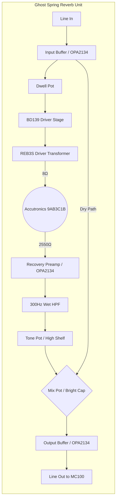

# Ghost Spring — Transformer-Coupled Single Spring Reverb

## 1. Concept & Vision
One spring. One voice. Fully solid-state for transparency, but transformer-coupled to the tank input for the organic "bloom" character that made the original Fender 6G15 Reverb Unit sound like nothing else. The transformer is the secret — it creates a resonant interaction with the spring's inductance that no direct-drive circuit can replicate.

This is the hi-fi case for simplicity: fewer components means fewer things to color the signal. All tube character comes from the Alembic FX-1 upstream. Everything downstream stays out of the way.

---

## 2. Architecture

### Topology
```
Solid State (100%)
├── OPA2134 input buffer (FET-input, unity gain, high-Z)
├── Dwell → BD139 discrete driver → REB3S transformer → tank
├── OPA2134 recovery preamp → 300Hz HPF → Tone → Mix
├── OPA2134 output buffer (low-Z, <100Ω)
└── ±15V internal linear power supply
```

### Input/Output
- **Input:** High-impedance (~1MΩ) via OPA2134 FET-input buffer — no loading on the QuadraVerb output
- **Output:** Low-impedance (<100Ω) via OPA2134 output buffer — drives long cable runs and MC100 RCA input cleanly
- **Signal path:** 100% analog

### Key Components
- **Op-amps:** OPA2134 (FET-input, transparent, high slew rate — same as the rest of the rig's DIY philosophy)
- **Driver transistor:** BD139 (high-current NPN, drives transformer primary)
- **Driver transformer:** Accutronics REB3S (dedicated spring reverb driver transformer, 8Ω secondary matches tank)
- **Spring tank:** Accutronics 9AB3C1B (Long, 3-spring, long decay, 8Ω input / 2550Ω output)
- **Power supply:** ±15V internal linear (toroidal 15VA, LM7815/LM7915)

### Why the 9AB3C1B
Three springs vs. two: denser, more uniform reverb tail with less of the metallic "ping" two-spring tanks can produce on hard attacks. The closest equivalent to the tank used in the original Fender 6G15 — Jerry Garcia's reverb unit of choice.

---

## 3. The Transformer: Why It Matters
The original Fender 6G15 drove the spring through an output transformer. The transformer's inductance forms a resonant circuit with the spring tank's input impedance, creating:
- A slight peak at ~2–3kHz on the attack transient (the "drip")
- Softer low-frequency drive vs. direct coupling (natural mud rejection without a filter)
- Galvanic isolation between the drive circuit and spring

The **Accutronics REB3S** is a transformer designed specifically for this application — used in boutique spring reverb units, correctly matched to 8Ω tanks.

---

## 4. Circuit Innovations

### Post-Recovery HPF (The "Bloom" Filter)
Unlike most DIY spring reverb designs that filter *before* the driver, this unit high-passes the wet signal *after recovery* at ~300Hz:
- Full-frequency transient enters the spring → the physical "thump" of the attack is preserved
- The reverb *tail* is filtered → low-end boom clears up as the sound decays
- Result: more natural-feeling attacks, cleaner tails

### Bright Cap on Mix Pot
A 47–100pF silver mica capacitor across the Mix pot maintains high-frequency detail at low reverb mix settings — the reverb tails stay "glassy" even when nearly blended out.

---

## 5. Signal Flow



---

## 6. Front Panel Controls

| Control | Type | Function |
|---|---|---|
| **Dwell** | 10k linear pot | Drive level into transformer — spring saturation |
| **Mix** | 100k audio pot + bright cap | Dry/wet blend |
| **Tone** | 100k audio pot | High-shelf EQ on wet signal only |

---

## 7. Power Supply
- **Type:** Internal linear supply
- **Transformer:** Toroidal 15VA (low magnetic interference)
- **Regulation:** ±15V DC (LM7815/LM7915) for maximum op-amp headroom

---

## 8. Mechanical
- **Tank mount:** Horizontal, open-side down, on four soft rubber isolation grommets
- **Enclosure:** 2U aluminum rackmount chassis
- **Front panel:** Custom aluminum via Front Panel Express (3 knobs, IEC inlet, power switch, 2× 1/4" jacks)
