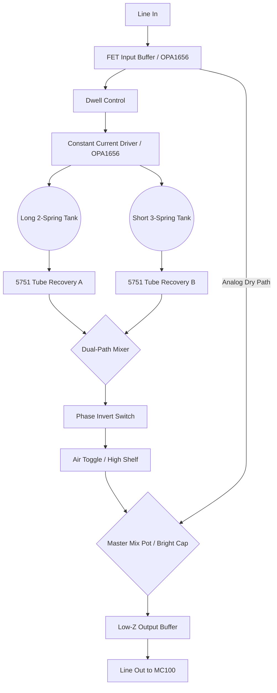

# "Badass" Dual-Path Hybrid Reverb — Design Document

## 1. Concept & Vision
The ultimate evolution of the spring reverb for a hi-fi guitar rig. Inspired by studio-grade processors (Demeter/AKG) and Jerry Garcia's 6G15-style placement, this unit uses **two independent spring tanks** in parallel to create a dense, multi-dimensional reverb field that avoids the "one-note" metallic ring of standard tanks.

## 2. Technical Specifications

### Input/Output
- **Input:** High-impedance (~1MΩ) FET-buffered.
- **Output:** Low-impedance (<100Ω) transformer-balanced or active-buffered.
- **Headroom:** ±18V DC internal rails for the solid-state driver; 250V DC for the tube recovery.

### The "Badass" Architecture
1.  **Dual-Tank Parallel Array:**
    - **Tank A (The Wash):** Accutronics 4AB3C1B (Long, 2-Spring, Long Decay). Provides the deep, ambient "Space" tail.
    - **Tank B (The Snap):** Accutronics 8AB2C1B (Short, 3-Spring, Medium Decay). Provides a tight, rhythmic "plate-like" response for chord slapping.
2.  **Constant-Current Driver:**
    - Powered by an **OPA1656** op-amp. Unlike standard drivers, this forces high-frequency current into the springs, preventing the "muddy" roll-off common in vintage units.
3.  **Hybrid Recovery Stage:**
    - **NOS 5751 Tube:** The tiny signal from the springs is amplified by a high-fidelity tube stage. This adds the 3D "air" and harmonic richness that matches the Alembic FX-1.

## 3. Signal Flow Diagram

## 4. Why This Works for Your Tone
- **Clarity:** The OPA1656 and "Anti-Mud" filter ensure your chord slapping stays articulate.
- **Density:** The two tanks "fill the gaps" in each other's reverb tails, creating a smoother, more "expensive" sound than a single tank.
- **DNA Match:** By using a 5751 for the recovery, the reverb's character perfectly complements the tubes in your Alembic FX-1.

## 5. Control Layout (2U Rack)
- **Dwell:** Saturation of the springs.
- **Mix A / Mix B:** Individual levels for each tank (allows "tuning" the room).
- **Master Mix:** Global Wet/Dry blend.
- **Tone:** High-shelf EQ on the reverb path.
- **Phase Toggle:** Switches polarity of Tank B to change reverb density.
- **Air Toggle:** Glassy high-end boost on recovery.
