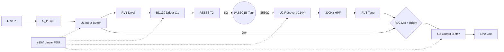

# Ghost Spring Reverb — Incremental Build Plan

> **Authority scope (single source of truth).** This file is the **design-rationale / build-order narrative**: what gets added at each stage and why. The **pass-criteria tables below are a convenience summary copied from [`test-assertions.md`](./test-assertions.md) — that file is authoritative. If a number here disagrees with test-assertions.md, test-assertions.md wins.** Component values and pass windows are tabulated canonically in [circuit-params.md](../circuit-params.md); the convenience tables below point there. Component values also come from [`stage_06_full.net`](./stage_06_full.net); parts/PNs from [`mouser-bom.csv`](../mouser-bom.csv); deeper rationale from [`parts-spec.md`](../parts-spec.md).

Build the circuit the way you'd write software with TDD: start from a verified MVP, add **one component group at a time**, and re-simulate after every addition. Each stage has its own `.asc` file so a regression is always bisectable to the last group you touched.

The companion file [`test-assertions.md`](./test-assertions.md) holds the exact `.meas` directives for every stage. Write those assertions **before** adding the component group, confirm they fail, add the parts, confirm they pass.

Reference: [`design.md`](../design.md) (architecture), [`parts-spec.md`](../parts-spec.md) (exact values + rationale).

---

## Signal chain (target)

Stages 2–5 each replace one idealized block of the MVP with its real hardware equivalent. Stage 6 confirms the whole chain still meets the Stage 1 numbers.

---

## Stage 1 — MVP baseline *(already built)*

| | |
|---|---|
| **What** | Three OPA2134 stages (U1 buffer, U2 recovery, U3 output), idealized direct drive (`R_drive` 560Ω) into a **lumped LCR tank model**, post-recovery 300Hz HPF, passive Mix/Tone/Bright network. Ideal `±15V` voltage sources. Input cap `C_in`, bias `R1`, and clamp diodes `Dclamp_p/Dclamp_n` are already present as placeholders. |
| **Why** | Establishes the verified signal-path skeleton (gain, filter corner, DC offset, stability) without any of the parts that introduce nonlinearity (transistor, transformer, regulators). Everything downstream is measured against these numbers. |
| **Starting schematic** | — (origin) |
| **Output schematic** | [`mvp_reverb.asc`](./mvp_reverb.asc) |
| **Tests** | `.op`, `.ac dec 100 20 20k`, `.tran 0 100m 0 1u` |

**Pass criteria** *(summary from [`test-assertions.md`](./test-assertions.md) — that file is authoritative if these disagree)*

| Check | Pass condition |
|---|---|
| DC offset, all op-amp outputs | within ±10 mV of 0 V |
| Recovery gain `V(u2_out)/V(u2_in_pos)` @ 1 kHz | 200× – 228× (214× ±3%) |
| Wet HPF −3 dB corner | 250 – 320 Hz (target ~284 Hz) |
| Output peak `V(v_out)` | < 14 V (not clipping) |
| Oscillation: RMS(last 10 ms)/RMS(first 10 ms) | < 1.05 |

> Run one analysis at a time. The MVP `.asc` has `.ac` active by default; comment it out and uncomment `.op` / `.tran` as needed.

---

## Stage 2 — BD139 driver stage

| | |
|---|---|
| **What** | Replace `R_drive` with a Class-A discrete driver: **Q1** (BD139), **R3** 1 kΩ (base series), **R3b** 6.8 kΩ (upper bias), **R4** 1 kΩ (lower bias), **R5** 68 Ω (emitter degeneration), **C2** 100 µF (emitter bypass), **D3** 1N4148 (flyback clamp, collector→+15 V). Keep the 1 µF Dwell-input coupling cap (BOM ref **C1**, named **`C_drive`** in the netlist) between the Dwell wiper and Q1's base, blocking the buffer's DC from the driver. (Note: the collector-side DC block from the tank/transformer winding is provided by the transformer's galvanic isolation — L1 is in the collector path, L2 feeds the tank — so no series collector cap is needed.) |
| **Why** | The op-amp can't source the ~16 mA needed to drive an 8 Ω tank through a transformer. Q1 is the current driver. R3b/R4 set the base voltage (~1.92 V open-circuit); R5 sets quiescent current and gives thermal stability. First-order, Ve ≈ Vb − Vbe ≈ 1.92 V − 0.7 V ≈ 1.22 V → Ic ≈ 1.22 V/68 Ω ≈ 18 mA. In the verified SPICE model the divider is loaded by Q1's base current and the real Vbe is higher at this current, so the *settled* operating point is **Ve ≈ 1.09 V → Ic ≈ 16 mA** (see `stage_06_full` op run). Both sit comfortably inside the 1.0–1.4 V / 10–26 mA pass band. C2 bypasses R5 for full AC gain. D3 clamps the transformer flyback spike into the +15 V rail. `C_drive` fixes the DC-bias problem: without it the collector's quiescent DC would sit across the tank/transformer winding. |
| **Starting schematic** | `mvp_reverb.asc` |
| **Output schematic** | `stage_02_driver.asc` |
| **Tests** | `.op` (bias point), `.tran 0 100m 0 1u` (drive current) |

**Pass criteria** *(summary from [`test-assertions.md`](./test-assertions.md) — that file is authoritative if these disagree)*

| Check | Pass condition |
|---|---|
| Q1 emitter voltage `V(q1_e)` | 1.0 – 1.4 V (first-order target 1.22 V; verified sim 1.09 V) |
| Q1 collector current `Ic(Q1)` | 10 – 26 mA (first-order target 18 mA; verified sim 16 mA; range covers hFE 40–250 spread) |
| D3 flyback current `I(D3)` peak | < 1 mA (not conducting in normal operation) |
| Drive current into load | clean, no clipping of the collector swing |

> Stage 2 still drives a resistive/lumped load (the transformer arrives in Stage 3). The collector load here is the existing tank-input lump through `C_drive`.

---

## Stage 3 — REB3S driver transformer

| | |
|---|---|
| **What** | Insert the **REB3S** as a coupled-inductor pair: **L1** (primary, in Q1's collector path), **L2** (8 Ω secondary, into the tank input), and **K1** the coupling statement `K1 L1 L2 1`. This **replaces the direct drive** from `C_drive` into the tank lump — the tank input is now fed only by L2. |
| **Why** | The transformer's primary inductance resonates with the tank input impedance to produce the ~2–3 kHz attack peak ("drip") of the original 6G15 — the entire reason this design is transformer-coupled. It also provides galvanic isolation so no DC reaches the tank coil. |
| **Starting schematic** | `stage_02_driver.asc` |
| **Output schematic** | `stage_03_transformer.asc` |
| **Tests** | `.ac dec 100 20 20k` (resonance + drive level) |

**Pass criteria** *(summary from [`test-assertions.md`](./test-assertions.md) — that file is authoritative if these disagree)*

| Check | Pass condition |
|---|---|
| Resonant peak at transformer/tank interface | 1 – 5 kHz (the "drip", target 2–3 kHz) |
| Drive level at `tank_in` | present, > −60 dB rel. driver input |

> Pick L1/L2 turns ratio and inductance to land the peak in band; verify by sweeping `.ac` and reading `V(tank_in)`. The mutual `K1` coupling coefficient should be ≈1 for a tightly wound driver transformer.

---

## Stage 4 — Input protection

| | |
|---|---|
| **What** | Promote the input front-end to its final form: confirm **C_in** 1 µF at the jack (already present), confirm **R1** 1 MΩ as a *shunt after* C_in (U1+ → GND), confirm the clamp pair **D_clamp+** (U1+ → +15 V) / **D_clamp−** (−15 V → U1+), and add **TVS1** (SMBJ15CA) bidirectional across tip→sleeve at the jack. |
| **Why** | C_in blocks any upstream DC offset. R1 gives the FET input its DC return *and* sets the 1 MΩ input impedance — it must sit after C_in, not in series before it. The 1N4148 clamps hard-limit the U1+ node to within ±15.6 V of the rails on slow overloads; TVS1 catches nanosecond ESD that the 1N4148s are too slow for. |
| **Starting schematic** | `stage_03_transformer.asc` |
| **Output schematic** | `stage_04_input_protect.asc` |
| **Tests** | `.op` (idle reverse-bias), `.tran` with 20 Vpp overload source |

**Pass criteria** *(summary from [`test-assertions.md`](./test-assertions.md) — that file is authoritative if these disagree)*

| Check | Pass condition |
|---|---|
| Clamp reverse-bias at idle `I(Dclamp_p)` | < 1 µA |
| Clamping under 20 Vpp overload `V(u1_pos)` | clamped to ±16 V max |

> For the overload test, swap `V1` to `SINE(0 10 1k)` (20 Vpp) and confirm `V(u1_pos)` never exceeds the clamp window. Restore the normal 100 mV source afterward.

---

## Stage 5 — Power supply rails

| | |
|---|---|
| **What** | Replace the ideal `Vpos`/`Vneg` sources with the real linear supply: **T1** (Triad F-219X, 15-0-15 secondary — model as two 15 VAC sources), **BR1** (W04G bridge), **C11/C12** 2200 µF main filter, **U4 LM7815** / **U5 LM7915** regulators, **C13/C14** 100 µF output caps, **C17/C18** 100 nF HF bypass, **R_bleed1/R_bleed2** 10 kΩ bleeders, **F2/F3** MF-R050 polyfuses on each rail. |
| **Why** | The op-amp stages and the driver run from ±15 V. This stage proves the regulators hold ±15 V within ±1 % and that ripple stays low enough not to leak into the 214× recovery stage. Bleed resistors discharge the 2200 µF caps for safe servicing; polyfuses current-limit each rail. |
| **Starting schematic** | `stage_04_input_protect.asc` |
| **Tests** | `.op` (rail voltages), `.tran` (ripple under load) |

**Pass criteria** *(summary from [`test-assertions.md`](./test-assertions.md) — that file is authoritative if these disagree)*

| Check | Pass condition |
|---|---|
| `V(+15V)` | 14.85 – 15.15 V (±1 %) |
| `V(-15V)` | −15.15 – −14.85 V (±1 %) |
| Supply ripple under load | < 10 mVpp |

> Model BR1 with four diodes (or a bridge subckt) and the secondary as two `SINE(0 21.2 60)` peak sources about the center tap. Run `.tran` long enough (≥100 ms) for the filter caps to settle before measuring ripple.

---

## Stage 6 — Full integration verification

| | |
|---|---|
| **What** | No new parts — the complete chain (real input protection → U1 → Dwell → BD139 driver → REB3S → tank → U2 recovery → HPF → Tone → Mix/Bright → U3) running from the real PSU. |
| **Why** | Confirms that adding the transistor, transformer, and switching from ideal rails to regulated rails did **not** regress any of the Stage 1 numbers. This is the green run for the whole feature. |
| **Starting schematic** | `stage_05_psu.asc` |
| **Output schematic** | `stage_06_full.asc` |
| **Tests** | `.op`, `.ac dec 100 20 20k`, `.tran 0 100m 0 1u` |

**Pass criteria** *(summary from [`test-assertions.md`](./test-assertions.md) — that file is authoritative if these disagree)*

| Check | Pass condition |
|---|---|
| All Stage 1 assertions | still pass |
| Complete DC operating point | within spec (all op-amp outputs ±10 mV; Q1 bias as Stage 2) |
| Full signal-chain gain | within ±2 dB of design target |

---

## Stage ledger

| Stage | Output `.asc` | Adds | Primary analysis |
|---|---|---|---|
| 1 | `mvp_reverb.asc` | baseline | .op / .ac / .tran |
| 2 | `stage_02_driver.asc` | Q1, R3, R3b, R4, R5, C2, D3, C_drive | .op / .tran |
| 3 | `stage_03_transformer.asc` | L1, L2, K1 | .ac |
| 4 | `stage_04_input_protect.asc` | C_in, D_clamp±, TVS1 | .op / .tran |
| 5 | `stage_05_psu.asc` | LM7815/7915, T1, BR1, C11–C14, C17/18, R_bleed1/2, F2/F3 | .op / .tran |
| 6 | `stage_06_full.asc` | (integration only) | .op / .ac / .tran |
