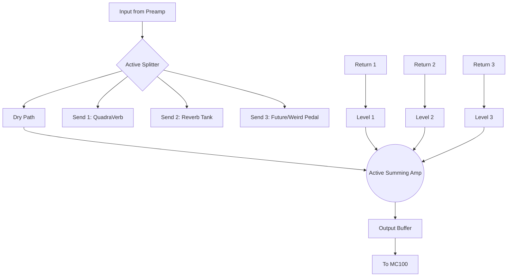

# 3-Channel Parallel Line Mixer — Design Document

## 1. Concept
In a high-fidelity guitar rig, placing digital or character-heavy pedals (like the QuadraVerb, Rainbow Machine, or MOTOR Pedal) in **series** can "choke" the dry signal, adding noise, latency, and digital artifacts. 

This **Parallel Line Mixer** allows you to maintain a 100% analog "Dry" path while blending in up to three effects loops in parallel.

## 2. Signal Architecture

## 3. DIY Implementation (The "Optimized" Build)
- **Op-Amps:** OPA2134 (High slew rate, FET-input for hifi clarity).
- **Topology:** Active Summing Mixer with unity-gain buffers.
- **Phase Control:** Each loop return includes a **Phase Invert Switch (180°)**. Critical for pedals that flip phase.
- **Headroom:** ±15V Rails (Internal linear supply).

---

## 4. Commercial & Used Alternatives (The "Buy Now" Path)
If you want to acquire a mixer quickly via the used market (Music Go Round, Reverb), look for these specific "sleeper" units.

### A. Used/Vintage (Best Value)
| Model | Est. Price | Role | Notes |
|---|---|---|---|
| **Rane SM26 / SM26S** | $60–$120 | Splitter/Mixer | The "Swiss Army Knife." 6 channels. Look for "S" version for standard power cord. |
| **DMC System Mix** | $100–$200 | Guitar Line Mixer | Designed by Digital Music Corp (pre-Voodoo Lab). Optimized for guitar levels. |
| **Rane SM82 / SM82S** | $80–$150 | Stereo Line Mixer | 8 Stereo channels. Legendary transparency. |
| **Behringer MX882** | $40–$70 | Splitter/Mixer | Modern clone of the Rane SM26. Cheapest entry point. |

### B. Modern / Premium
| Model | Est. Price | Role | Notes |
|---|---|---|---|
| **RJM Micro Line Mixer** | $250 | Summing Mixer | Very small, ±15V rails, extremely high fidelity. |
| **GigRig Wetter Box** | $280 | Dual Parallel Loop | Includes expression pedal input for fading in "Space" effects. |
| **Lehle Parallel M** | $180 | Single Parallel Loop | Best-in-class transparency and phase correction. |

---

## 5. Why Parallel Mixing is Essential for Your "Hifi" Goal
- **Digital Preservation:** Keeps your dry signal analog. The 16-bit converters in the QuadraVerb will only affect the "Wet" tails, not your core tone.
- **Experimental Safety:** "Weird" pedals (MOTOR, Rainbow Machine) can be blended in. If a pedal makes a weird noise or sucks tone, you just turn its Mix knob down without losing your main signal.
- **Phase Alignment:** Commercial units (except Rane) and our DIY design include phase switches. If your tone sounds "thin" when blending a pedal, flip the phase.

## 6. Pro-Tip: "Kill Dry"
When using any of these mixers, you **must** set your effects (QuadraVerb, etc.) to **100% Wet / Kill Dry**. If the pedal outputs a dry signal, it will clash with your main dry path and cause "comb filtering" (a hollow, weak sound).
